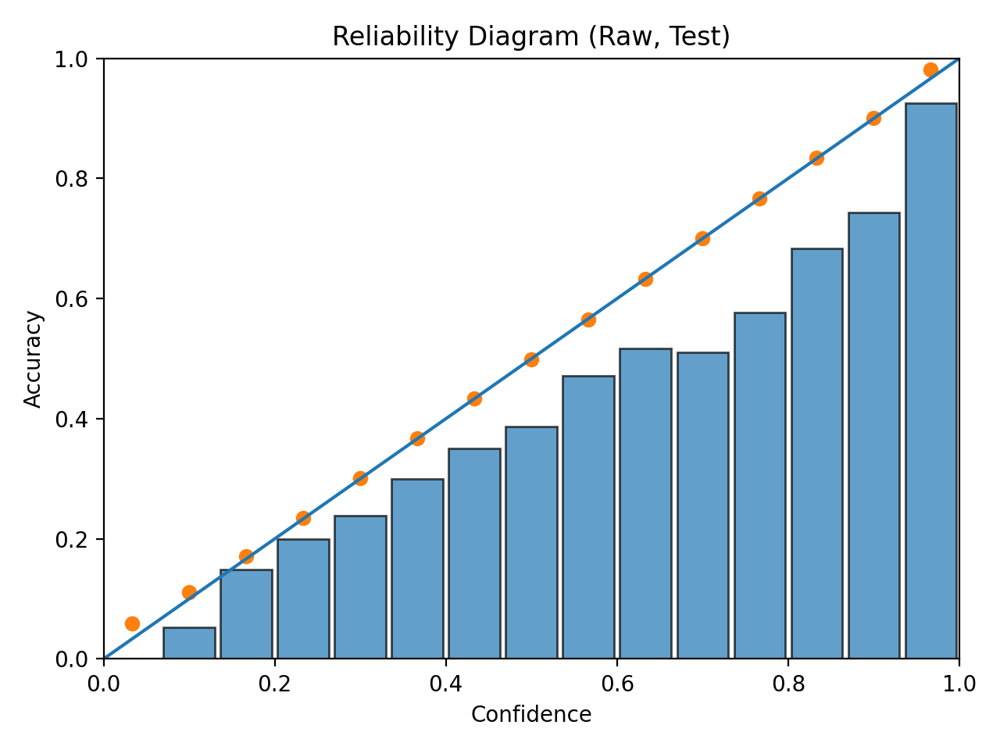
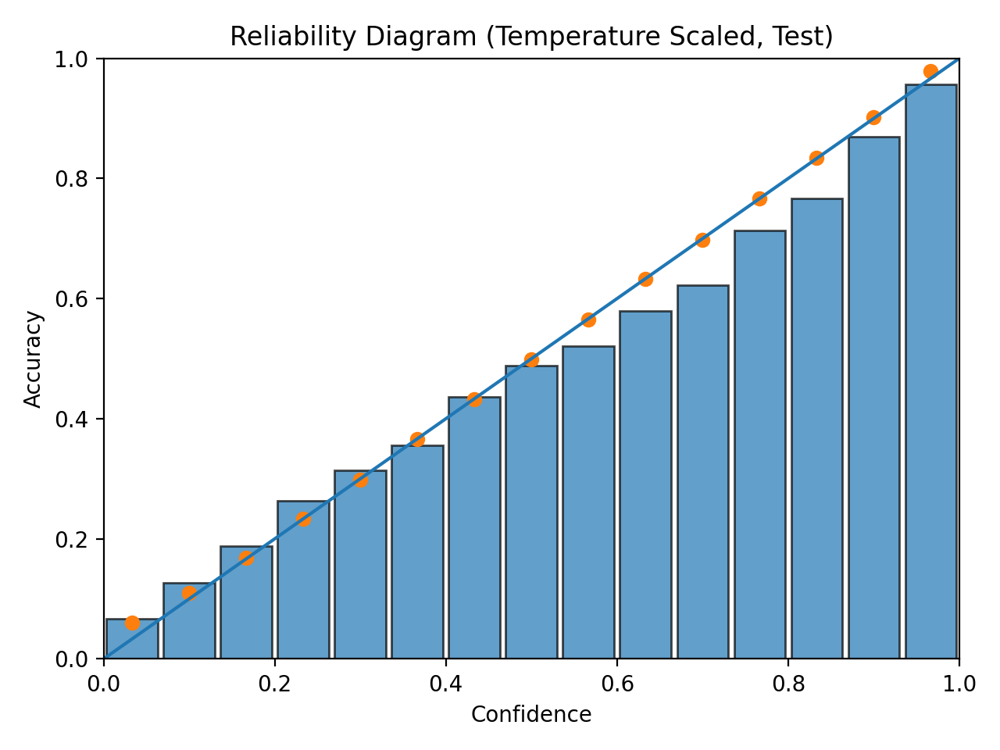
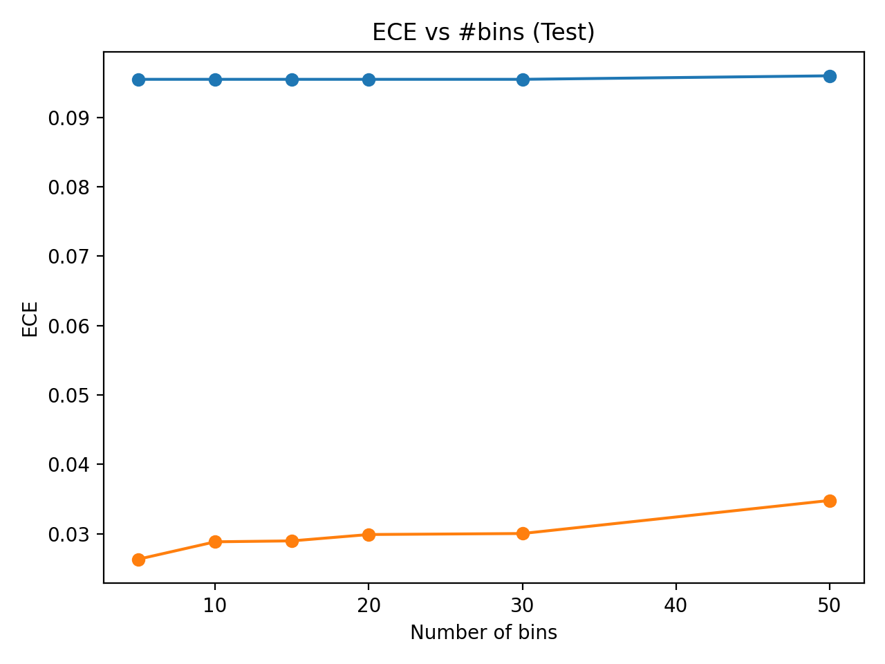

# Neural Network Calibration - PyTorch Replication (Guo et al., 2017)


A principled PyTorch replication of **“On Calibration of Modern Neural Networks”** (Guo et al., 2017).  
Trains a modern classifier on CIFAR, evaluates calibration (**ECE, MCE, NLL**, reliability diagrams), and applies **post-hoc temperature scaling** to improve confidence estimates **without changing accuracy** (argmax unchanged).

## What v0.1.0 covers

- Dataset: CIFAR (configurable: CIFAR-10 or CIFAR-100)
- Model: torchvision **ResNet18** adapted for CIFAR (3×3 conv, no maxpool)
- Metrics: Accuracy, NLL, ECE (15 bins), MCE (+ optional Brier)
- Calibration method: **Temperature scaling** fit on validation logits (single scalar T)

## Results (v0.1.0)

Temperature scaling substantially improves calibration:

- **Test ECE:** **0.09 → 0.02**
- **Test accuracy:** unchanged (argmax invariant under T-scaling)

### Reliability diagrams (test)

Raw:



Temperature scaled:



## Installation

```bash
pip install -e .
```

## Reproduce (end-to-end)

### 1) Train

```bash
python scripts/run_train.py --config configs/default.yaml
```

Produces:
- `outputs/checkpoints/best.pt`
- `outputs/reports/train_log.jsonl`

### 2) Evaluate (export logits + raw metrics)

```bash
python scripts/run_eval.py --config configs/default.yaml --ckpt outputs/checkpoints/best.pt
```

Produces:
- `outputs/reports/val_logits.pt`, `outputs/reports/val_labels.pt`
- `outputs/reports/test_logits.pt`, `outputs/reports/test_labels.pt`
- `outputs/reports/metrics_raw.json`
- `outputs/figures/reliability_raw.png`

### 3) Calibrate (temperature scaling) + calibrated metrics

```bash
python scripts/run_calibrate.py --config configs/default.yaml
```

Produces:
- `outputs/reports/temperature.json`
- `outputs/reports/metrics_temp.json`
- `outputs/figures/reliability_temp.png`

### ECE sensitivity to bin count

Temperature scaling improves calibration across a range of bin counts.



## Testing

```bash
python -m pytest -q
```

## Notes on reproducibility

- Train/validation split is deterministic given `seed` and `val_fraction` in `configs/default.yaml`.
- Temperature scaling is fit **only** on the validation set; test set is used only for final evaluation.
- ECE is computed using **equal-width bins** with **M=15**, matching common practice in the paper.

## Citation

If you use this repo, please cite:

Guo, C., Pleis, G., Sun, Y., & Weinberger, K. Q. (2017). *On Calibration of Modern Neural Networks*. ICML.

---